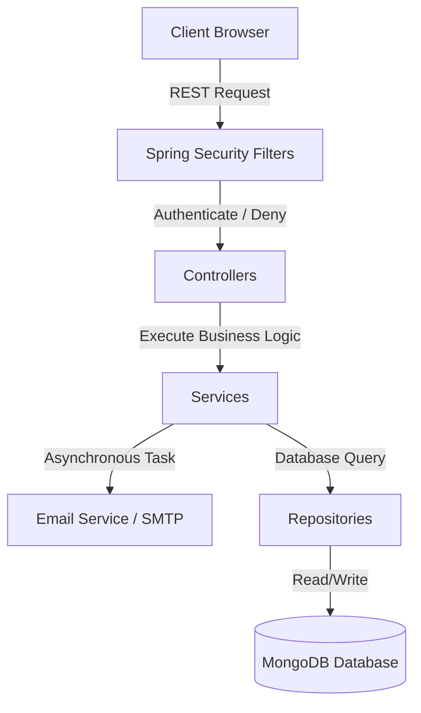

# Aiden Backend Development Context & Prompt Seed

This document contains a comprehensive summary of the **Aiden Blog Application Backend**, its complete directory structure, the individual role of every file, and the full source code of the crucial classes.

> [!TIP]
> **How to use this file:**
> Upload this entire file or copy-paste its content as the very first message (the "seed prompt") when starting a new chat with Gemini or any coding assistant. This gives the AI full contextual knowledge of your system, enabling it to write 100% accurate code changes, add new features, or debug issues instantly!

---

## 📋 The Seed Prompt (Copy & Paste this to start a new chat)

```text
You are an expert Java and Spring Boot software architect. I am developing "Aiden", an interactive, AI-enhanced blogging platform for coders. 

I am attaching the complete backend development context (including the folder structure, file roles, database schemas, security configurations, and full source codes). 

Please study this architecture carefully. In this chat, I will ask you to:
1. Implement new REST endpoints or database collections.
2. Modify existing service logic or controllers.
3. Write unit or integration tests.
4. Enhance the security filters or caching layers.

Always maintain design pattern consistency (Controller-Service-Repository-Entity) and ensure your code integrates perfectly with the existing security filters and MongoDB schemas described in the context.

Here is the entire codebase context:
[Upload or paste the content of backend_development_context.md here]
```

---

## 🏗️ Part 1: High-Level Backend Architecture

Aiden's backend is a **Spring Boot REST API** built with **Java 17** and **MongoDB** as the database. It is secured using **Spring Security** supporting both stateless **Basic Auth** (combined with local registration + OTP activation) and stateful **OAuth2 Social Login** (Google and GitHub).



### Key Technical Patterns
1. **Asynchronous Notification Pipeline**: Email alerts for subscribers are handled out-of-process via Spring's `@Async` thread executor so that content-creation writes return to the browser in milliseconds.
2. **Defensive SMTP Email Catching**: General `Exception` handling surrounds SMTP operations, ensuring dummy `.env` credentials or local offline development do not crash user registration or post publishing.
3. **Smart OTP Activation**: Accounts are created in an unverified state. A 4-digit code is generated and saved in MongoDB, then printed directly to the system console for local testing.
4. **Social Session Synchronization**: OAuth2 logins sync state with Spring Security and write secure session cookies (`SameSite=None; Secure; HttpOnly`) back to the client.

---

## 📂 Part 2: Backend Folder Structure & File Roles

```text
Blog-Backend/
│
├── .mvn/                           # Maven wrapper configuration
├── pom.xml                         # Project dependencies, build plugins, and JVM parameters
├── Dockerfile                      # Production build container config
├── mvnw / mvnw.cmd                 # Unix & Windows Maven wrappers
│
└── src/main/java/com/blog/Blog_Backend/
    │
    ├── BlogBackendApplication.java # Core application bootstrapper (Enables Async & Caching)
    │
    ├── config/                     # Security configuration & Auth Filters
    │   ├── AppConfig.java          # PasswordEncoder bean & JSON mapper beans
    │   ├── WebConfig.java          # CORS registry and MVC mappings
    │   ├── SecurityConfig.java     # Filters, URL permits, basic auth, & OAuth login config
    │   ├── UserPrincipal.java      # Wrapper converting User entity into Spring UserDetails
    │   ├── CustomUserDetailsService.java     # Lookup user in DB for Basic Auth
    │   ├── CustomOAuth2UserService.java      # Intercepts Google/GitHub OAuth profile streams
    │   ├── UnifiedOAuth2UserService.java     # General router for social profile mapping
    │   ├── CustomOidcUser.java               # Custom OpenID wrapper for Google accounts
    │   └── CustomAuthenticationEntryPoint.java # JSON error handler for failed authentications
    │
    ├── controller/                 # HTTP endpoint routing (Ingests JSON / Multipart)
    │   ├── AuthController.java     # Checks session status
    │   ├── UserController.java     # Registration, OTP verification, profiles, pic updates
    │   ├── BlogPostController.java # CRUD for blogs, comments, nested replies
    │   ├── NotificationController.java # In-app notification marks and updates
    │   ├── SubscriberController.java   # Writer-specific subscriptions
    │   ├── GeneralSubscriberController.java # General newsletter subscriptions
    │   ├── PingController.java     # Health diagnostics check
    │   └── TestController.java     # Setup integration diagnostics
    │
    ├── entity/                     # MongoDB Database Document Schemas
    │   ├── User.java               # Users: emails, BCrypt passwords, pics, socials, verify state
    │   ├── BlogPost.java           # Blogs: title, markdown text, images, nested Comment structures
    │   ├── Comment.java            # Comment schema supporting sub-comment arrays (Replies)
    │   ├── OTP.java                # 4-digit codes, expiration timestamps, used flags
    │   ├── Notification.java       # In-app feed items for subscribers
    │   ├── Subscriber.java         # Mappings between readers and subscribed authors
    │   └── GeneralSubscriber.java  # Mappings for global newsletter registrations
    │
    ├── repository/                 # Database Query Abstract Layer (Spring Data MongoDB)
    │   ├── UserRepository.java     # Queries users by email or set of emails
    │   ├── BlogPostRepository.java # Core operations on blogs
    │   ├── OTPRepository.java      # CRUD on activation keys
    │   ├── NotificationRepository.java # Queries notification feeds
    │   ├── SubscriberRepository.java   # Resolves author-reader relationships
    │   └── GeneralSubscriberRepository.java # Resolves general newsletter email sets
    │
    └── service/                    # Central Core Business Logic (Data Mutations & IO Threads)
        ├── UserService.java        # BCrypt hashing, profile updates, verified flags
        ├── BlogPostService.java    # Excerpting text, validation, base64 mapping
        ├── OTPService.java         # Secure Random 4-digit code generator & console printing
        └── EmailService.java       # Asynchronous subscriber broadcasts & defensive SMTP sending
```

---

## 💻 Part 3: The Complete Core Backend Codebase

This section contains the full, complete source codes of the crucial configuration files, controllers, services, and entities in the Aiden backend.

### ⚙️ 1. pom.xml (Dependencies & Caching)
```xml
<?xml version="1.0" encoding="UTF-8"?>
<project xmlns="http://maven.apache.org/POM/4.0.0" xmlns:xsi="http://www.w3.org/2001/XMLSchema-instance"
         xsi:schemaLocation="http://maven.apache.org/POM/4.0.0 https://maven.apache.org/xsd/maven-4.0.0.xsd">
    <modelVersion>4.0.0</modelVersion>
    <parent>
        <groupId>org.springframework.boot</groupId>
        <artifactId>spring-boot-starter-parent</artifactId>
        <version>3.4.5</version>
        <relativePath/>
    </parent>
    <groupId>com.blog</groupId>
    <artifactId>Blog-Backend</artifactId>
    <version>0.0.1-SNAPSHOT</version>
    <name>Blog-Backend</name>
    <description>Blog Application for Coders</description>

    <properties>
        <java.version>17</java.version>
    </properties>
    <dependencies>
        <!-- Spring Boot Starter Mail -->
        <dependency>
            <groupId>org.springframework.boot</groupId>
            <artifactId>spring-boot-starter-mail</artifactId>
        </dependency>
        <!-- Jakarta Mail API -->
        <dependency>
            <groupId>com.sun.mail</groupId>
            <artifactId>jakarta.mail</artifactId>
            <version>2.0.1</version>
        </dependency>
        <dependency>
            <groupId>org.springframework.boot</groupId>
            <artifactId>spring-boot-starter</artifactId>
        </dependency>
        <dependency>
            <groupId>org.springframework.boot</groupId>
            <artifactId>spring-boot-starter-test</artifactId>
            <scope>test</scope>
        </dependency>
        <dependency>
            <groupId>org.springframework.boot</groupId>
            <artifactId>spring-boot-starter-data-mongodb</artifactId>
        </dependency>
        <dependency>
            <groupId>org.springframework.boot</groupId>
            <artifactId>spring-boot-starter-web</artifactId>
        </dependency>
        <dependency>
            <groupId>org.springframework.boot</groupId>
            <artifactId>spring-boot-starter-security</artifactId>
        </dependency>
        <dependency>
            <groupId>org.springframework.boot</groupId>
            <artifactId>spring-boot-starter-cache</artifactId>
        </dependency>
        <dependency>
            <groupId>org.springframework.boot</groupId>
            <artifactId>spring-boot-starter-actuator</artifactId>
        </dependency>
        <dependency>
            <groupId>org.springframework.boot</groupId>
            <artifactId>spring-boot-starter-oauth2-client</artifactId>
        </dependency>
        <dependency>
            <groupId>org.springframework.boot</groupId>
            <artifactId>spring-boot-starter-webflux</artifactId>
        </dependency>
        <!-- Dotenv to resolve .env variables locally -->
        <dependency>
            <groupId>me.paulschwarz</groupId>
            <artifactId>spring-dotenv</artifactId>
            <version>4.0.0</version>
        </dependency>
    </dependencies>
    <build>
        <plugins>
            <plugin>
                <groupId>org.springframework.boot</groupId>
                <artifactId>spring-boot-maven-plugin</artifactId>
            </plugin>
        </plugins>
    </build>
</project>
```

---

### 🛡️ 2. SecurityConfig.java
```java
package com.blog.Blog_Backend.config;

import org.springframework.beans.factory.annotation.Autowired;
import org.springframework.beans.factory.annotation.Value;
import org.springframework.context.annotation.Bean;
import org.springframework.context.annotation.Configuration;
import org.springframework.http.HttpMethod;
import org.springframework.security.config.Customizer;
import org.springframework.security.config.annotation.web.builders.HttpSecurity;
import org.springframework.security.config.annotation.web.configuration.EnableWebSecurity;
import org.springframework.security.config.http.SessionCreationPolicy;
import org.springframework.security.core.userdetails.UserDetailsService;
import org.springframework.security.crypto.bcrypt.BCryptPasswordEncoder;
import org.springframework.security.crypto.password.PasswordEncoder;
import org.springframework.security.web.SecurityFilterChain;
import org.springframework.web.cors.CorsConfiguration;
import org.springframework.web.cors.CorsConfigurationSource;
import org.springframework.web.cors.UrlBasedCorsConfigurationSource;

import java.util.Arrays;
import java.util.List;

@Configuration
@EnableWebSecurity
public class SecurityConfig {

    @Autowired
    private UserDetailsService userDetailsService;

    private final UnifiedOAuth2UserService unifiedOAuth2UserService;
    private final CustomAuthenticationEntryPoint customAuthenticationEntryPoint;

    @Value("${app.cors.allowed-origins}")
    private List<String> allowedOrigins;

    @Value("${app.oauth.success-url}")
    private String oauthSuccessUrl;

    @Value("${app.oauth.failure-url}")
    private String oauthFailureUrl;

    public SecurityConfig(UnifiedOAuth2UserService unifiedOAuth2UserService, CustomAuthenticationEntryPoint customAuthenticationEntryPoint) {
        this.unifiedOAuth2UserService = unifiedOAuth2UserService;
        this.customAuthenticationEntryPoint = customAuthenticationEntryPoint;
    }

    @Bean
    public SecurityFilterChain securityFilterChain(HttpSecurity http) throws Exception {
        http
                .cors(cors -> cors.configurationSource(corsConfigurationSource()))
                .csrf(csrf -> csrf.disable())
                .authorizeHttpRequests(authorize -> authorize
                        .requestMatchers("/login/**", "/oauth2/**").permitAll()
                        .requestMatchers(HttpMethod.OPTIONS, "/**").permitAll()
                        .requestMatchers(HttpMethod.POST, "/api/users").permitAll()
                        .requestMatchers(HttpMethod.GET, "/api/blogs").permitAll()
                        .requestMatchers(HttpMethod.POST, "/api/users/verify").permitAll()
                        .requestMatchers(HttpMethod.POST, "/api/users/resend-otp").permitAll()
                        .requestMatchers(HttpMethod.GET, "/api/blogs/{blogId}").authenticated()
                        .requestMatchers(HttpMethod.POST, "/api/blogs").authenticated()
                        .requestMatchers(HttpMethod.PUT, "/api/blogs").authenticated()
                        .requestMatchers(HttpMethod.DELETE, "/api/blogs/{blogId}").authenticated()
                        .requestMatchers(HttpMethod.POST, "/api/blogs/{blogId}/comments").authenticated()
                        .requestMatchers(HttpMethod.POST, "/api/blogs/{blogId}/comments/{parentCommentId}/replies").authenticated()
                        .requestMatchers(HttpMethod.GET, "/api/users/**").authenticated()
                        .requestMatchers(HttpMethod.PUT, "/api/users/**").authenticated()
                        .requestMatchers(HttpMethod.PATCH, "/api/users/**").authenticated()
                        .requestMatchers("/api/notifications/**").authenticated()
                        .anyRequest().permitAll()
                )
                .sessionManagement(session -> session
                        .sessionCreationPolicy(SessionCreationPolicy.IF_REQUIRED)
                )
                .userDetailsService(userDetailsService)
                .httpBasic(Customizer.withDefaults())
                .exceptionHandling(exceptions ->
                        exceptions.authenticationEntryPoint(customAuthenticationEntryPoint)
                )
                .oauth2Login(oauth -> oauth
                        .userInfoEndpoint(ue -> ue
                                .userService(unifiedOAuth2UserService::loadUser)
                                .oidcUserService(unifiedOAuth2UserService::loadUser)
                        )
                        .defaultSuccessUrl(oauthSuccessUrl, true)
                        .failureUrl(oauthFailureUrl)
                );
        return http.build();
    }

    @Bean
    CorsConfigurationSource corsConfigurationSource() {
        CorsConfiguration config = new CorsConfiguration();
        config.setAllowedOrigins(allowedOrigins);
        config.setAllowedMethods(Arrays.asList("GET", "POST", "PUT", "DELETE", "OPTIONS", "PATCH"));
        config.setAllowedHeaders(Arrays.asList("*"));
        config.setAllowCredentials(true);

        UrlBasedCorsConfigurationSource source = new UrlBasedCorsConfigurationSource();
        source.registerCorsConfiguration("/**", config);
        return source;
    }

    @Bean
    public PasswordEncoder passwordEncoder() {
        return new BCryptPasswordEncoder();
    }
}
```

---

### ⚙️ 3. EmailService.java (Defensive SMTP Tasks)
```java
package com.blog.Blog_Backend.service;

import com.blog.Blog_Backend.entity.GeneralSubscriber;
import com.blog.Blog_Backend.entity.Notification;
import com.blog.Blog_Backend.entity.Subscriber;
import com.blog.Blog_Backend.repository.GeneralSubscriberRepository;
import com.blog.Blog_Backend.repository.NotificationRepository;
import com.blog.Blog_Backend.repository.SubscriberRepository;
import org.slf4j.Logger;
import org.slf4j.LoggerFactory;
import org.springframework.beans.factory.annotation.Autowired;
import org.springframework.beans.factory.annotation.Value;
import org.springframework.mail.javamail.JavaMailSender;
import org.springframework.mail.javamail.JavaMailSenderImpl;
import org.springframework.mail.javamail.MimeMessageHelper;
import org.springframework.scheduling.annotation.Async;
import org.springframework.stereotype.Service;

import jakarta.mail.MessagingException;
import jakarta.mail.internet.MimeMessage;

import java.io.IOException;
import java.net.URLEncoder;
import java.nio.charset.StandardCharsets;
import java.time.LocalDateTime;
import java.util.ArrayList;
import java.util.List;

@Service
public class EmailService {

    private static final Logger logger = LoggerFactory.getLogger(EmailService.class);

    @Autowired
    private JavaMailSender mailSender;

    @Autowired
    private SubscriberRepository subscriberRepository;

    @Autowired
    private GeneralSubscriberRepository generalSubscriberRepository;

    @Autowired
    private NotificationRepository notificationRepository;

    @Value("${app.frontend.base-url}")
    private String frontendBaseUrl;

    @Autowired
    public EmailService(JavaMailSender mailSender) {
        this.mailSender = mailSender;
        if (mailSender instanceof JavaMailSenderImpl) {
            JavaMailSenderImpl impl = (JavaMailSenderImpl) mailSender;
            impl.getJavaMailProperties().setProperty("mail.smtp.connectiontimeout", "10000");
            impl.getJavaMailProperties().setProperty("mail.smtp.timeout", "10000");
            impl.getJavaMailProperties().setProperty("mail.smtp.writetimeout", "10000");
        }
    }

    @Async
    public void sendNewBlogNotification(String blogTitle, String blogId, String authorEmail) {
        logger.info("⏳ Sending notifications for new blog: {}", blogTitle);
        List<Notification> notifications = new ArrayList<>();

        List<Subscriber> authorSubscribers = subscriberRepository.findBySubscribedAuthorsContaining(authorEmail);
        for (Subscriber subscriber : authorSubscribers) {
            notifications.add(createNotification(blogTitle, blogId, authorEmail, subscriber.getEmail()));
        }

        List<GeneralSubscriber> generalSubscribers = generalSubscriberRepository.findAll();
        for (GeneralSubscriber subscriber : generalSubscribers) {
            notifications.add(createNotification(blogTitle, blogId, authorEmail, subscriber.getEmail()));
        }

        notificationRepository.saveAll(notifications);

        for (Subscriber subscriber : authorSubscribers) {
            sendEmailAsync(
                    subscriber.getEmail(),
                    "New Blog Posted by Your Subscribed Author",
                    createNewBlogEmailContent(blogTitle, blogId, subscriber.getEmail(), authorEmail, true)
            );
        }

        for (GeneralSubscriber subscriber : generalSubscribers) {
            sendEmailAsync(
                    subscriber.getEmail(),
                    "New Blog Posted on AIDEN",
                    createNewBlogEmailContent(blogTitle, blogId, subscriber.getEmail(), null, false)
            );
        }

        logger.info("📬 Sent to {} subscribers", authorSubscribers.size() + generalSubscribers.size());
    }

    @Async
    public void sendUpdatedBlogNotification(String blogTitle, String blogId, String authorEmail) {
        List<Notification> notifications = new ArrayList<>();

        List<Subscriber> authorSubscribers = subscriberRepository.findBySubscribedAuthorsContaining(authorEmail);
        for (Subscriber subscriber : authorSubscribers) {
            notifications.add(createNotification(blogTitle, blogId, authorEmail, subscriber.getEmail()));
        }

        List<GeneralSubscriber> generalSubscribers = generalSubscriberRepository.findAll();
        for (GeneralSubscriber subscriber : generalSubscribers) {
            notifications.add(createNotification(blogTitle, blogId, authorEmail, subscriber.getEmail()));
        }

        notificationRepository.saveAll(notifications);

        for (Subscriber subscriber : authorSubscribers) {
            sendEmailAsync(
                    subscriber.getEmail(),
                    "Blog Updated by Your Subscribed Author",
                    createUpdatedBlogEmailContent(blogTitle, blogId, subscriber.getEmail(), authorEmail, true)
            );
        }

        for (GeneralSubscriber subscriber : generalSubscribers) {
            sendEmailAsync(
                    subscriber.getEmail(),
                    "Blog Updated on AIDEN",
                    createUpdatedBlogEmailContent(blogTitle, blogId, subscriber.getEmail(), null, false)
            );
        }
    }

    @Async
    public void sendEmailAsync(String to, String subject, String htmlContent) {
        MimeMessage message = mailSender.createMimeMessage();
        try {
            MimeMessageHelper helper = new MimeMessageHelper(message, true, "UTF-8");
            helper.setTo(to);
            helper.setSubject(subject);
            helper.setText(htmlContent, true);
            mailSender.send(message);
        } catch (Exception e) {
            logger.error("Failed to send email to {}", to, e);
        }
    }

    private Notification createNotification(String blogTitle, String blogId, String authorEmail, String userEmail) {
        Notification notification = new Notification();
        notification.setUserEmail(userEmail);
        notification.setBlogId(blogId);
        notification.setAuthorEmail(authorEmail);
        notification.setBlogTitle(blogTitle);
        notification.setCreatedAt(LocalDateTime.now());
        notification.setRead(false);
        return notification;
    }

    public void sendEmail(String to, String subject, String htmlContent) {
        try {
            MimeMessage message = mailSender.createMimeMessage();
            MimeMessageHelper helper = new MimeMessageHelper(message, true, "UTF-8");
            helper.setTo(to);
            helper.setSubject(subject);
            helper.setText(htmlContent, true);
            mailSender.send(message);
        } catch (Exception e) {
            System.err.println("Failed to send email to " + to + ": " + e.getMessage());
        }
    }

    private String trimmedBaseUrl() {
        return frontendBaseUrl.endsWith("/")
                ? frontendBaseUrl.substring(0, frontendBaseUrl.length() - 1)
                : frontendBaseUrl;
    }

    private String buildUnsubscribeUrl(String email, String authorEmail, boolean isAuthorSpecific) {
        String encodedEmail = URLEncoder.encode(email, StandardCharsets.UTF_8);
        String base = trimmedBaseUrl();
        return isAuthorSpecific
                ? base + "/unsubscribe/author?email=" + encodedEmail
                        + "&authorEmail=" + URLEncoder.encode(authorEmail, StandardCharsets.UTF_8)
                : base + "/unsubscribe/general?email=" + encodedEmail;
    }

    private String createNewBlogEmailContent(String blogTitle, String blogId, String email, String authorEmail, boolean isAuthorSpecific) {
        String unsubscribeUrl = buildUnsubscribeUrl(email, authorEmail, isAuthorSpecific);
        String blogUrl = trimmedBaseUrl() + "/blog/" + blogId;
        String message = isAuthorSpecific
                ? "A new blog titled <strong>" + blogTitle + "</strong> has been posted by your subscribed author."
                : "A new blog titled <strong>" + blogTitle + "</strong> has been posted on AIDEN.";
        String unsubscribeText = isAuthorSpecific
                ? "Unsubscribe from this author"
                : "Unsubscribe from AIDEN updates";

        return "<html>" +
                "<body style='font-family: Arial, sans-serif; color: #333;'>" +
                "<h2>New Blog Posted on AIDEN!</h2>" +
                "<p>" + message + "</p>" +
                "<p>Read it now: <a href='" + blogUrl + "' style='color: #4B6CB7; text-decoration: none;'>View Blog</a></p>" +
                "<p>Stay tuned for more updates!</p>" +
                "<p><small><a href='" + unsubscribeUrl + "' style='color: #999;'>" + unsubscribeText + "</a></small></p>" +
                "</body>" +
                "</html>";
    }

    private String createUpdatedBlogEmailContent(String blogTitle, String blogId, String email, String authorEmail, boolean isAuthorSpecific) {
        String unsubscribeUrl = buildUnsubscribeUrl(email, authorEmail, isAuthorSpecific);
        String blogUrl = trimmedBaseUrl() + "/blog/" + blogId;
        String message = isAuthorSpecific
                ? "The blog titled <strong>" + blogTitle + "</strong> has been updated by your subscribed author."
                : "The blog titled <strong>" + blogTitle + "</strong> has been updated on AIDEN.";
        String unsubscribeText = isAuthorSpecific
                ? "Unsubscribe from this author"
                : "Unsubscribe from AIDEN updates";

        return "<html>" +
                "<body style='font-family: Arial, sans-serif; color: #333;'>" +
                "<h2>Blog Updated on AIDEN!</h2>" +
                "<p>" + message + "</p>" +
                "<p>Check out the updates: <a href='" + blogUrl + "' style='color: #4B6CB7; text-decoration: none;'>View Blog</a></p>" +
                "<p>Stay tuned for more updates!</p>" +
                "<p><small><a href='" + unsubscribeUrl + "' style='color: #999;'>" + unsubscribeText + "</a></small></p>" +
                "</body>" +
                "</html>";
    }
}
```

---

### ⚙️ 4. OTPService.java (Code Generator & Logger)
```java
package com.blog.Blog_Backend.service;

import com.blog.Blog_Backend.entity.OTP;
import com.blog.Blog_Backend.repository.OTPRepository;
import org.springframework.beans.factory.annotation.Autowired;
import org.springframework.stereotype.Service;

import java.security.SecureRandom;
import java.time.LocalDateTime;
import java.util.Optional;

@Service
public class OTPService {

    @Autowired
    private OTPRepository otpRepository;

    @Autowired
    private EmailService emailService;

    private static final int OTP_LENGTH = 4;
    private static final int OTP_EXPIRY_MINUTES = 5;

    private String generateOTP() {
        SecureRandom random = new SecureRandom();
        StringBuilder otp = new StringBuilder();
        for (int i = 0; i < OTP_LENGTH; i++) {
            otp.append(random.nextInt(10));
        }
        return otp.toString();
    }

    public void sendOTP(String email) {
        otpRepository.deleteByEmail(email);

        String code = generateOTP();
        System.out.println("\n🔑 [SECURITY] Generated OTP for " + email + ": " + code + "\n");
        LocalDateTime now = LocalDateTime.now();
        OTP otp = new OTP(email, code, now, now.plusMinutes(OTP_EXPIRY_MINUTES));
        otpRepository.save(otp);

        String subject = "Verify Your AIDEN Account";
        String htmlContent = "<html>" +
                "<body style='font-family: Arial, sans-serif; color: #333;'>" +
                "<h2>Welcome to AIDEN!</h2>" +
                "<p>Please use the following 4-digit code to verify your account:</p>" +
                "<p style='font-size: 24px; font-weight: bold; color: #4B6CB7;'>" + code + "</p>" +
                "<p>This code will expire in " + OTP_EXPIRY_MINUTES + " minutes.</p>" +
                "<p>If you did not request this, please ignore this email.</p>" +
                "</body>" +
                "</html>";
        emailService.sendEmail(email, subject, htmlContent);
    }

    public boolean verifyOTP(String email, String code) {
        Optional<OTP> otpOpt = otpRepository.findByEmailAndCodeAndUsedFalse(email, code);
        if (otpOpt.isEmpty()) {
            return false;
        }
        OTP otp = otpOpt.get();
        if (otp.getExpiresAt().isBefore(LocalDateTime.now()) || otp.isUsed()) {
            return false;
        }
        otp.setUsed(true);
        otpRepository.save(otp);
        return true;
    }
}
```

---

### ⚙️ 5. UserService.java (Business Logic & BCrypt)
```java
package com.blog.Blog_Backend.service;

import com.blog.Blog_Backend.entity.User;
import com.blog.Blog_Backend.repository.UserRepository;
import com.blog.Blog_Backend.utility.SecurityUtils;
import org.springframework.beans.factory.annotation.Autowired;
import org.springframework.cache.annotation.CachePut;
import org.springframework.cache.annotation.Cacheable;
import org.springframework.http.HttpStatus;
import org.springframework.security.crypto.password.PasswordEncoder;
import org.springframework.stereotype.Service;
import org.springframework.web.multipart.MultipartFile;
import org.springframework.web.server.ResponseStatusException;

import java.io.IOException;
import java.util.*;
import java.util.function.Function;
import java.util.stream.Collectors;

@Service
public class UserService {

    @Autowired
    private UserRepository userRepository;

    @Autowired
    private PasswordEncoder passwordEncoder;

    @Autowired
    private OTPService otpService;

    public User createUser(User user) {
        if (userRepository.findByEmail(user.getEmail()).isPresent()) {
            throw new ResponseStatusException(HttpStatus.BAD_REQUEST, "Email already registered");
        }
        if (user.getPassword() != null) {
            user.setPassword(passwordEncoder.encode(user.getPassword()));
        }
        user.setVerified(false);
        User savedUser = userRepository.save(user);
        otpService.sendOTP(user.getEmail());
        return savedUser;
    }

    public User verifyUser(String email, String otp) {
        if (!otpService.verifyOTP(email, otp)) {
            throw new ResponseStatusException(HttpStatus.BAD_REQUEST, "Invalid or expired OTP");
        }
        User user = userRepository.findByEmail(email)
                .orElseThrow(() -> new ResponseStatusException(HttpStatus.NOT_FOUND, "User not found"));
        user.setVerified(true);
        return userRepository.save(user);
    }

    @CachePut(value = "users", key = "#email")
    public User updateUserByEmail(String email, User updates) {
        String currentUserEmail = SecurityUtils.getCurrentUserEmail();
        if (currentUserEmail == null || !currentUserEmail.equals(email)) {
            throw new ResponseStatusException(HttpStatus.FORBIDDEN, "You are not authorized to update this user");
        }

        User existing = userRepository.findByEmail(email)
                .orElseThrow(() -> new ResponseStatusException(HttpStatus.NOT_FOUND, "User not found"));

        if ("OAUTH_PASSWORD".equals(existing.getPassword()) && updates.getPassword() != null) {
            throw new ResponseStatusException(HttpStatus.BAD_REQUEST, "OAuth users cannot set passwords");
        }

        existing.setName(updates.getName());

        if (updates.getPassword() != null && !"OAUTH_PASSWORD".equals(existing.getPassword())) {
            existing.setPassword(passwordEncoder.encode(updates.getPassword()));
        }

        existing.setPhone(updates.getPhone());
        existing.setLinkedin(updates.getLinkedin());
        existing.setGithub(updates.getGithub());
        existing.setTwitter(updates.getTwitter());
        existing.setAbout(updates.getAbout());

        return userRepository.save(existing);
    }

    @CachePut(value = "users", key = "#email")
    public User updateProfilePicByEmail(String email, MultipartFile file) {
        String currentUserEmail = SecurityUtils.getCurrentUserEmail();
        if (currentUserEmail == null || !currentUserEmail.equals(email)) {
            throw new ResponseStatusException(HttpStatus.FORBIDDEN, "You are not authorized to update this user");
        }

        User existing = userRepository.findByEmail(email)
                .orElseThrow(() -> new ResponseStatusException(HttpStatus.NOT_FOUND, "User not found"));
        try {
            existing.setPhoto(file.getBytes());
        } catch (IOException e) {
            throw new ResponseStatusException(HttpStatus.BAD_REQUEST, "Unable to read file");
        }
        return userRepository.save(existing);
    }

    @Cacheable(value = "users", key = "#email")
    public User getUserByEmail(String email) {
        return userRepository.findByEmail(email)
                .orElseThrow(() -> new ResponseStatusException(HttpStatus.NOT_FOUND, "User not found"));
    }

    public String getLinkedInLinkByEmail(String email) {
        User user = userRepository.findByEmail(email)
                .orElseThrow(() -> new ResponseStatusException(HttpStatus.NOT_FOUND, "User not found"));
        return user.getLinkedin();
    }

    public String getTwitterLinkByEmail(String email) {
        User user = userRepository.findByEmail(email)
                .orElseThrow(() -> new ResponseStatusException(HttpStatus.NOT_FOUND, "User not found"));
        return user.getTwitter();
    }

    public String getGitHubLinkByEmail(String email) {
        User user = userRepository.findByEmail(email)
                .orElseThrow(() -> new ResponseStatusException(HttpStatus.NOT_FOUND, "User not found"));
        return user.getGithub();
    }

    @Cacheable(value = "users", key = "#emails.hashCode()")
    public Map<String, User> getUsersByEmails(Set<String> emails) {
        if (emails.isEmpty()) return Collections.emptyMap();

        return userRepository.findByEmailIn(new ArrayList<>(emails))
                .stream()
                .collect(Collectors.toMap(User::getEmail, Function.identity()));
    }

    public Map<String, String> getUserNamesByEmails(Set<String> emails) {
        return getUsersByEmails(emails).entrySet().stream()
                .collect(Collectors.toMap(
                        Map.Entry::getKey,
                        e -> e.getValue().getName())
                );
    }
}
```

---

### ⚙️ 7. UserController.java (REST Controller)
```java
package com.blog.Blog_Backend.controller;

import com.blog.Blog_Backend.entity.BlogPost;
import com.blog.Blog_Backend.entity.User;
import com.blog.Blog_Backend.service.BlogPostService;
import com.blog.Blog_Backend.service.OTPService;
import com.blog.Blog_Backend.service.UserService;
import com.blog.Blog_Backend.utility.SecurityUtils;
import com.fasterxml.jackson.databind.ObjectMapper;
import org.slf4j.Logger;
import org.slf4j.LoggerFactory;
import org.springframework.beans.factory.annotation.Autowired;
import org.springframework.http.HttpStatus;
import org.springframework.http.ResponseEntity;
import org.springframework.web.bind.annotation.*;
import org.springframework.web.multipart.MultipartFile;
import org.springframework.web.server.ResponseStatusException;

import java.util.HashMap;
import java.util.List;
import java.util.Map;

@RestController
@RequestMapping("/api/users")
public class UserController {

    private static final Logger logger = LoggerFactory.getLogger(UserController.class);

    @Autowired
    private UserService userService;

    @Autowired
    private OTPService otpService;

    @Autowired
    private BlogPostService blogPostService;

    @Autowired
    private ObjectMapper objectMapper;

    @PostMapping(consumes = {"multipart/form-data"})
    public ResponseEntity<Map<String, String>> createUser(
            @RequestPart("user") String userJson,
            @RequestPart(value = "photo", required = false) MultipartFile photo
    ) {
        try {
            User user = objectMapper.readValue(userJson, User.class);
            if (photo != null) {
                try {
                    user.setPhoto(photo.getBytes());
                } catch (Exception e) {
                    throw new RuntimeException("Failed to process photo", e);
                }
            }
            userService.createUser(user);
            Map<String, String> response = new HashMap<>();
            response.put("message", "User registered. Please verify your email with the OTP sent.");
            response.put("email", user.getEmail());
            return new ResponseEntity<>(response, HttpStatus.CREATED);
        } catch (Exception e) {
            logger.error("Failed to create user", e);
            throw new ResponseStatusException(HttpStatus.INTERNAL_SERVER_ERROR, "Failed to create user");
        }
    }

    @PostMapping("/verify")
    public ResponseEntity<User> verifyOTP(@RequestBody Map<String, String> request) {
        String email = request.get("email");
        String otp = request.get("otp");
        if (email == null || otp == null) {
            return new ResponseEntity<>(HttpStatus.BAD_REQUEST);
        }
        User verifiedUser = userService.verifyUser(email, otp);
        return ResponseEntity.ok(verifiedUser);
    }

    @PostMapping("/resend-otp")
    public ResponseEntity<Map<String, String>> resendOTP(@RequestBody Map<String, String> request) {
        String email = request.get("email");
        if (email == null) {
            return new ResponseEntity<>(HttpStatus.BAD_REQUEST);
        }
        User user = userService.getUserByEmail(email);
        if (user.isVerified()) {
            throw new ResponseStatusException(HttpStatus.BAD_REQUEST, "User is already verified");
        }
        otpService.sendOTP(email);
        Map<String, String> response = new HashMap<>();
        response.put("message", "New OTP sent to your email.");
        return ResponseEntity.ok(response);
    }

    @PutMapping("/profile")
    public ResponseEntity<User> updateUser(@RequestBody User updates) {
        String email = SecurityUtils.getCurrentUserEmail();
        if (email == null) {
            return new ResponseEntity<>(HttpStatus.UNAUTHORIZED);
        }
        User updated = userService.updateUserByEmail(email, updates);
        return ResponseEntity.ok(updated);
    }

    @PatchMapping(value = "/profile/photo", consumes = {"multipart/form-data"})
    public ResponseEntity<User> updatePhoto(@RequestPart("photo") MultipartFile photo) {
        String email = SecurityUtils.getCurrentUserEmail();
        if (email == null) {
            return new ResponseEntity<>(HttpStatus.UNAUTHORIZED);
        }
        User updated = userService.updateProfilePicByEmail(email, photo);
        return ResponseEntity.ok(updated);
    }

    @GetMapping("/profile")
    public ResponseEntity<Map<String, Object>> getUserInfoAndBlogs() {
        String email = SecurityUtils.getCurrentUserEmail();
        if (email == null) {
            return new ResponseEntity<>(HttpStatus.UNAUTHORIZED);
        }
        User user = userService.getUserByEmail(email);
        logger.info("Fetched user: email={}, isVerified={}", email, user.isVerified());
        if (!user.isVerified()) {
            logger.warn("User not verified: email={}", email);
            return new ResponseEntity<>(HttpStatus.FORBIDDEN);
        }
        List<BlogPost> blogs = blogPostService.getBlogsByAuthorEmail(email);
        Map<String, Object> response = new HashMap<>();
        response.put("user", user);
        response.put("blogs", blogs);
        return ResponseEntity.ok(response);
    }

    @GetMapping("/profile/linkedin")
    public ResponseEntity<String> getLinkedInLink() {
        String email = SecurityUtils.getCurrentUserEmail();
        if (email == null) {
            return new ResponseEntity<>(HttpStatus.UNAUTHORIZED);
        }
        String link = userService.getLinkedInLinkByEmail(email);
        return ResponseEntity.ok(link);
    }

    @GetMapping("/profile/twitter")
    public ResponseEntity<String> getTwitterLink() {
        String email = SecurityUtils.getCurrentUserEmail();
        if (email == null) {
            return new ResponseEntity<>(HttpStatus.UNAUTHORIZED);
        }
        String link = userService.getTwitterLinkByEmail(email);
        return ResponseEntity.ok(link);
    }

    @GetMapping("/profile/github")
    public ResponseEntity<String> getGitHubLink() {
        String email = SecurityUtils.getCurrentUserEmail();
        if (email == null) {
            return new ResponseEntity<>(HttpStatus.UNAUTHORIZED);
        }
        String link = userService.getGitHubLinkByEmail(email);
        return ResponseEntity.ok(link);
    }
}
```
